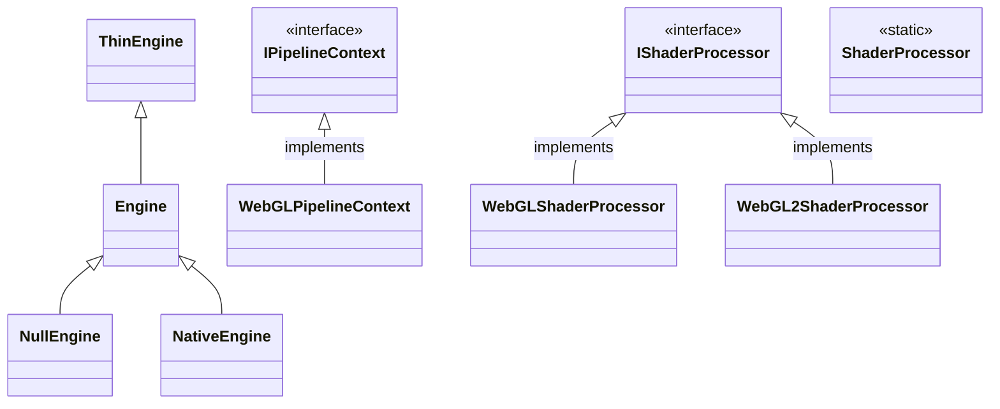
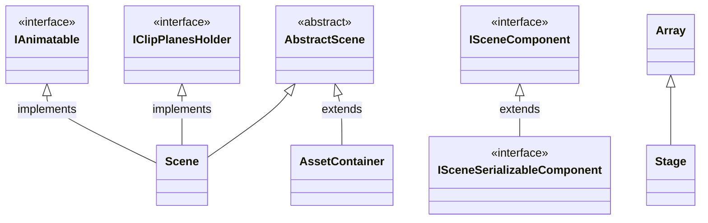
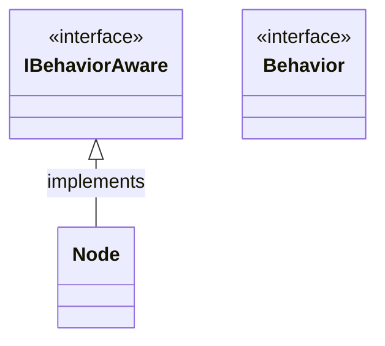
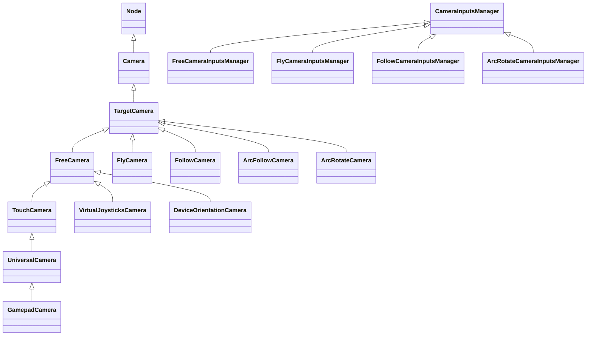
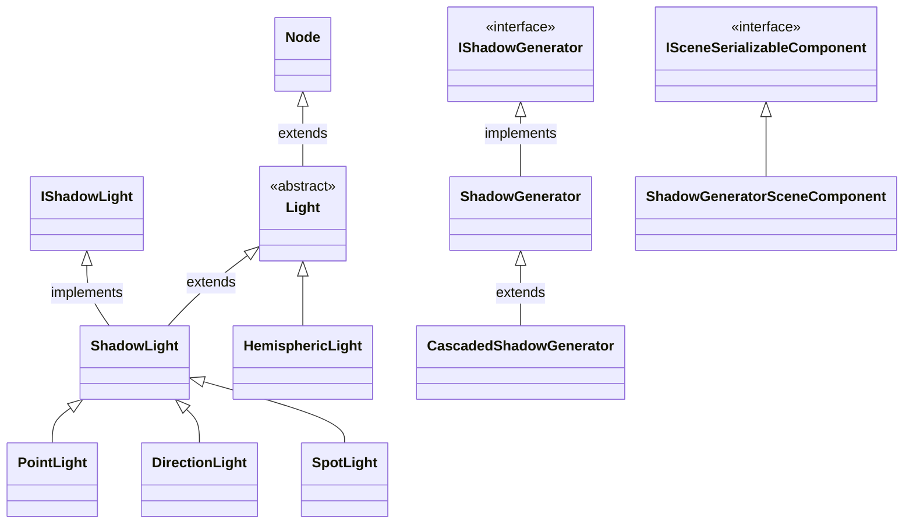
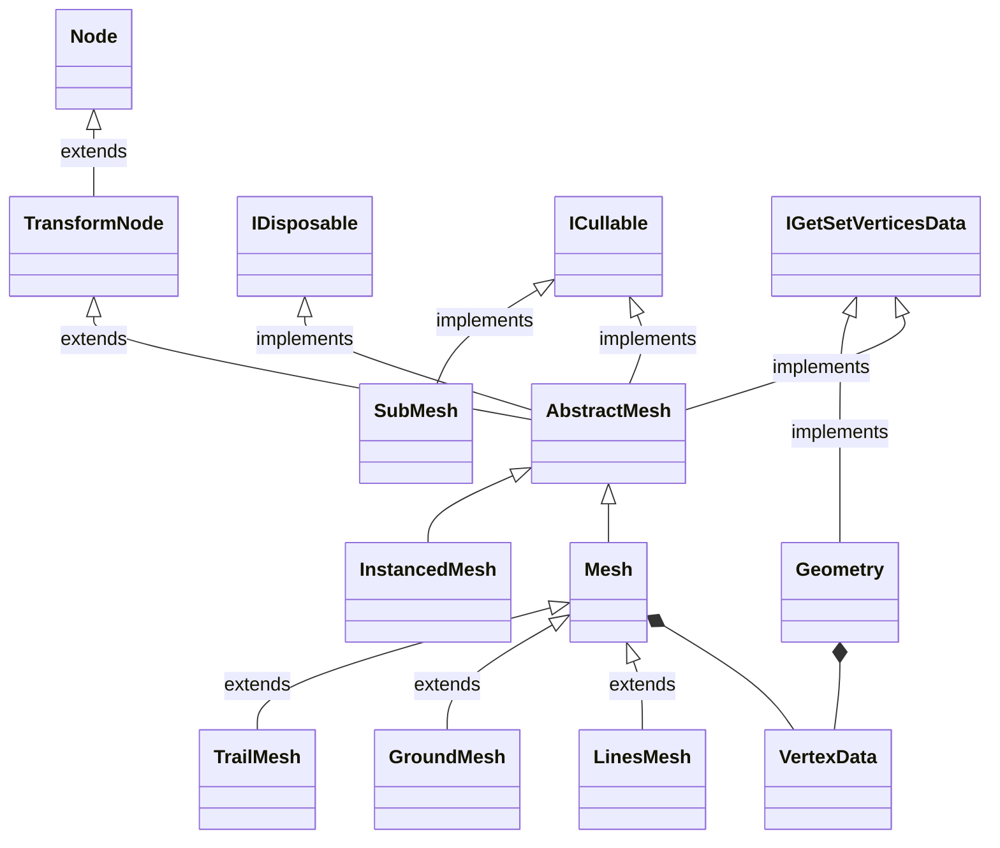
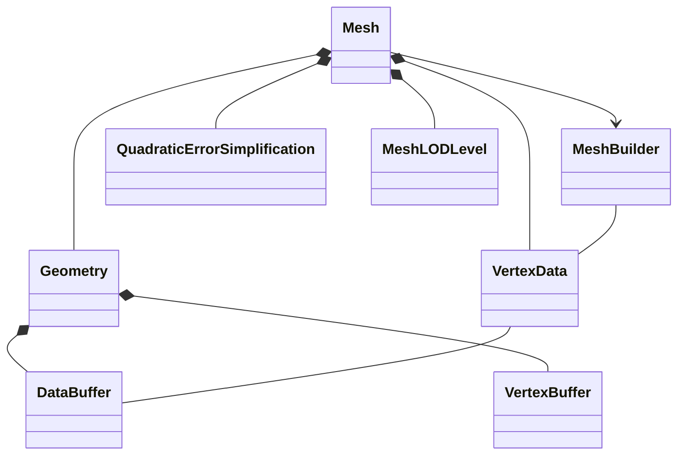
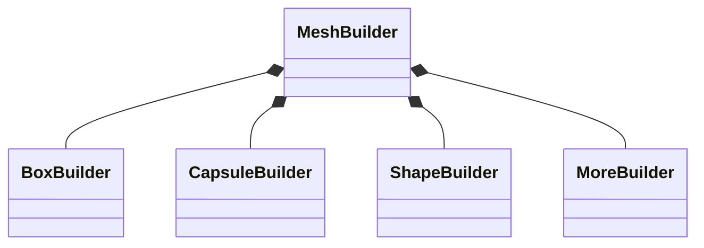
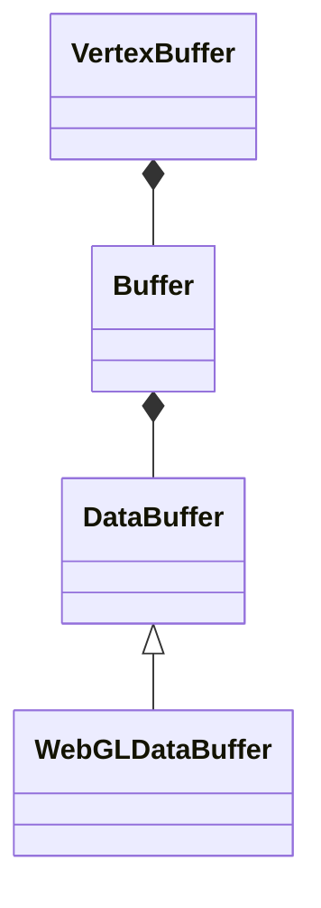
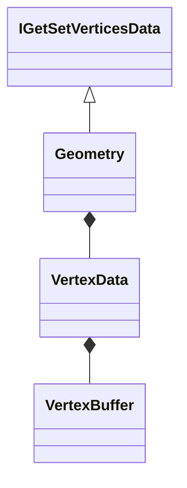

# core

# Overview
## Engine   

```mermaid
classDiagram

ThinEngine <|-- Engine
Engine <|-- NullEngine
Engine <|-- NativeEngine

IPipelineContext <|-- WebGLPipelineContext : implements
<<interface>> IPipelineContext

IShaderProcessor <|-- WebGLShaderProcessor : implements
IShaderProcessor <|-- WebGL2ShaderProcessor : implements
<<interface>> IShaderProcessor

class ShaderProcessor {
    <<static>>
}

```

## Scene  

```mermaid
classDiagram

IAnimatable <|-- Scene : implements
IClipPlanesHolder <|-- Scene : implements
AbstractScene <|-- Scene
AbstractScene <|-- AssetContainer : extends

<<interface>> IAnimatable
<<interface>> IClipPlanesHolder
<<abstract>> AbstractScene

ISceneComponent <|-- ISceneSerializableComponent : extends
<<interface>> ISceneComponent
<<interface>> ISceneSerializableComponent
Array <|-- Stage

```

## Node  

```mermaid
classDiagram

IBehaviorAware <|-- Node : implements
<<interface>> IBehaviorAware

class Behavior {
    <<interface>>
}

```

### Camera  

```mermaid
classDiagram

Node <|-- Camera
Camera <|-- TargetCamera
TargetCamera <|-- FreeCamera
TargetCamera <|-- FlyCamera
TargetCamera <|-- FollowCamera
TargetCamera <|-- ArcFollowCamera
TargetCamera <|-- ArcRotateCamera
FreeCamera <|-- TouchCamera
TouchCamera <|-- UniversalCamera
UniversalCamera <|-- GamepadCamera
FreeCamera <|-- VirtualJoysticksCamera
FreeCamera <|-- DeviceOrientationCamera

CameraInputsManager <|-- FreeCameraInputsManager
CameraInputsManager <|-- FlyCameraInputsManager
CameraInputsManager <|-- FollowCameraInputsManager
CameraInputsManager <|-- ArcRotateCameraInputsManager

```

### Light

```mermaid
classDiagram

Node <|-- Light : extends
Light <|-- ShadowLight : extends
IShadowLight <|-- ShadowLight : implements
ShadowLight <|-- PointLight
ShadowLight <|-- DirectionLight
ShadowLight <|-- SpotLight
Light <|-- HemisphericLight

<<abstract>> Light

IShadowGenerator <|-- ShadowGenerator : implements
ShadowGenerator <|-- CascadedShadowGenerator : extends
ISceneSerializableComponent <|-- ShadowGeneratorSceneComponent
<<interface>> IShadowGenerator
<<interface>> ISceneSerializableComponent


```

### Mesh

```mermaid
classDiagram

%% Mesh
Node <|-- TransformNode : extends
TransformNode <|-- AbstractMesh : extends
IDisposable <|-- AbstractMesh : implements
ICullable <|-- AbstractMesh : implements
IGetSetVerticesData <|-- AbstractMesh : implements
IGetSetVerticesData <|-- Geometry : implements
Geometry *-- VertexData
Mesh *-- VertexData

AbstractMesh <|-- Mesh
AbstractMesh <|-- InstancedMesh

%% 线条
Mesh <|-- LinesMesh : extends
%% 地面
Mesh <|-- GroundMesh : extends
%% 踪迹
Mesh <|-- TrailMesh : extends
%% Mesh分块
ICullable <|-- SubMesh : implements

```

&starf; 关系

```mermaid
classDiagram

Mesh --> MeshBuilder
Mesh *-- Geometry
Mesh *-- VertexData
Mesh *-- QuadraticErrorSimplification
Mesh *-- MeshLODLevel
Geometry *-- VertexBuffer
Geometry *-- DataBuffer
VertexData -- DataBuffer
MeshBuilder -- VertexData

```

&starf; Builder

```mermaid
classDiagram

MeshBuilder *-- BoxBuilder
MeshBuilder *-- CapsuleBuilder
MeshBuilder *--  ShapeBuilder
MeshBuilder *--  MoreBuilder

```

&starf; Buffer

```mermaid
classDiagram

VertexBuffer *-- Buffer
Buffer *-- DataBuffer
DataBuffer <|-- WebGLDataBuffer

```

&starf; Geometry  

```mermaid
classDiagram

IGetSetVerticesData <|-- Geometry
Geometry *-- VertexData
VertexData *-- VertexBuffer

```

