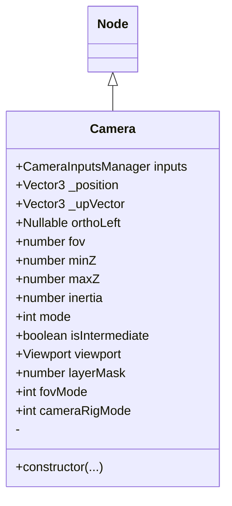

```mermaid
classDiagram

Node <|-- Camera

class Camera {
    +CameraInputsManager<Camera> inputs
    +Vector3 _position
    +Vector3 _upVector
    +Nullable<number> orthoLeft
    +number fov
    +number minZ
    +number maxZ
    +number inertia
    +int mode
    +boolean isIntermediate
    +Viewport viewport
    +number layerMask
    +int fovMode
    +int cameraRigMode
    -

    +constructor(...)
}

```