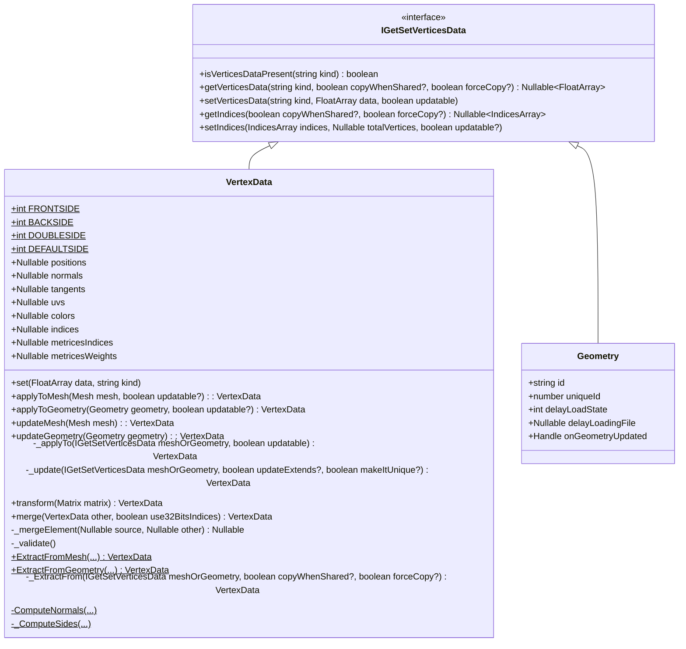

# **Mesh** 
# Overview

# Table of Content
## Mesh

## VertexData
### &#9758; *class*

### &#9758; *kind*
&starf; positions  
包含顶点位置信息的数组
[..., x, y, z, ...]

&starf; normals  
包含顶点法线信息的数组
[..., x, y, z, ...]

&starf; tangents  
包含顶点切向信息的数组
[..., x, y, z, ...]

&starf; uvs  
使用uv将纹理图片映射到顶点上的数组
UV ~ UV6

&starf; colors  
顶点颜色的数组

&starf; matricesIndecies  
由骨骼生成的矩阵的索引列表  
每个顶点有4个索引 (如果设置了extra则是8个)

&starf; matricesWeights  
最终估算过程中的每个索引matrix的权重值列表

&starf; matricesIndicesExtra  
扩展矩阵索引

&starf; matricesWeightsExtra  
扩展矩阵权重

&starf; indices  
构成三角形的三个顶点的索引
[..., i, j, k, ...]

### &#9758; *methods*
* \+ set(data: FloatArray, king: string): void  
    > 为VertexData按类型设置数据
