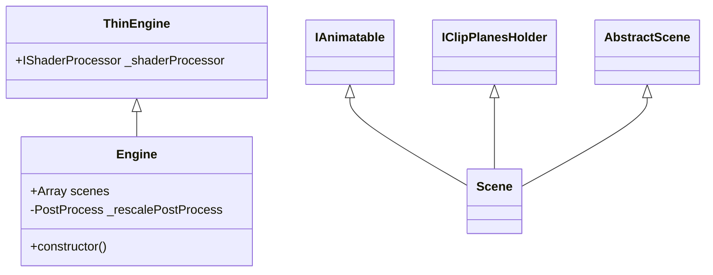

# core

# Overview
## class relationship

```mermaid
classDiagram

ThinEngine <|-- Engine

IAnimatable <|-- Scene
IClipPlanesHolder <|-- Scene
AbstractScene <|-- Scene

class ThinEngine {
    +IShaderProcessor _shaderProcessor
}

class Engine {
    +Array<Scene> scenes
    -PostProcess _rescalePostProcess
    +constructor()
}

```

# Table Of Contents
## Engine

## Scene

## Camera

## Light

## Mesh

