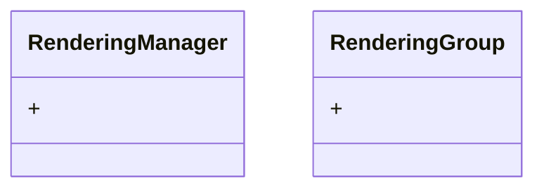
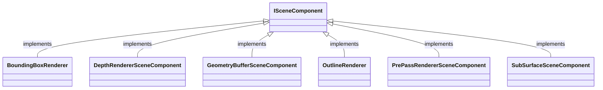
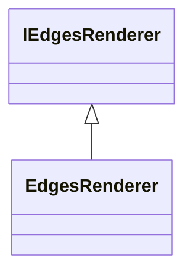

# **rendering**

&emsp;  
# Overview
## class map

```mermaid
classDiagram

class RenderingManager {
    +
}

class RenderingGroup {
    +
}

```

```mermaid
classDiagram

ISceneComponent <|-- BoundingBoxRenderer : implements
ISceneComponent <|-- DepthRendererSceneComponent : implements

ISceneComponent <|-- GeometryBufferSceneComponent : implements
ISceneComponent <|-- OutlineRenderer : implements

ISceneComponent <|-- PrePassRendererSceneComponent : implements

ISceneComponent <|-- SubSurfaceSceneComponent : implements

```

```mermaid
classDiagram

IEdgesRenderer <|-- EdgesRenderer

```

&emsp;  
# Table of Contents