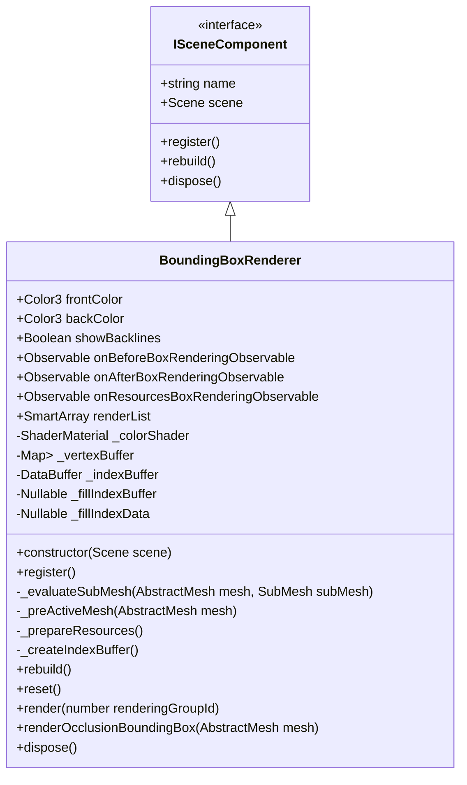
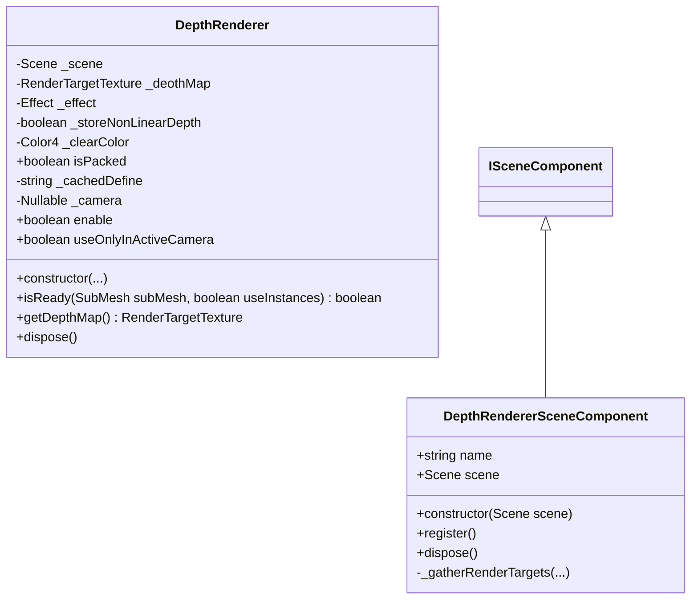
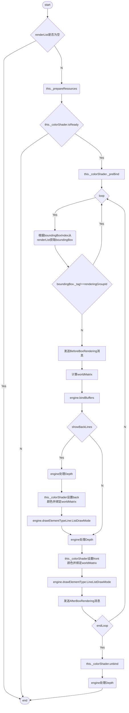

# **Renderer**

# Overview
## BoundingBoxRenderer

## DepthRenderer & DepthRendererSceneComponent

# Table of Contents
## BoundingBoxRenderer
### methods
#### \+ constructor(scene: Scene)
> scene._addComponent(this)

#### \+register()
注册  
before active  
> this.scene._beforeEvaluateActiveMeshStage.registerStep()  

pre active
> this.scene._preActiveMeshStage.registerStep()  

sub mesh  
> this.scene._evaluateSubMeshStage.registerStep()  

after rendering group  
> this.scene._afterRenderingGroupDrawStage()  

#### \- _evaluateSubMesh(mesh: AbstractMesh, subMesh: SubMesh)
评估sub mesh  

#### \- _preActiveMesh(mesh: AbstractMesh)

#### \- _prepareResources()
预备_colorShader  
1.已有color shader直接返回void  
2.没有则 new ShaderMaterial  
3.设置_vertexBuffers  
4.createIndexBuffer  
5.设置_fillIndexData  
6.onResourcesReadyObserverable.notifyObservers

#### \- _createIndexBuffer()
使用this.scene.getEngine()创建index buffer

#### \+ rebuild()
1.rebuild vertexbuffer [PositionKind]  
2._createIndexBuffer()  

#### \+ reset()
置空renderList  
renderList.reset()

#### \+ render(renderingGroupId: number)
根据指定的render中的tag，循环renderList里面的tag与renderingGroupId相同的boundingBox，进行draw操作  
draw包含front和back

#### \+ renderOcclusionBoundingBox(mesh: AbstractMesh): void
1、准备resources  
2、判定this._colorShader和boundingInfo是否ready  
3、判定this._fillIndexBuffer是否存在，不存在则使用engine创建  
4、计算worldMatrix
5、engine.bindBuffers: vertexBuffer、fillIndexBuffer、colorShader
6、设置depthFunction, colorShader设置worldMatrix
7、engine.drawElementType
8、复原colorShader、DepthFunction

#### \+ dispose
1、observable.clear
2、renderList.dispose
3、colorShader.dispose
4、vertexBuffer.dispose
5、engine.releaseBuffer

## DepthRenderer