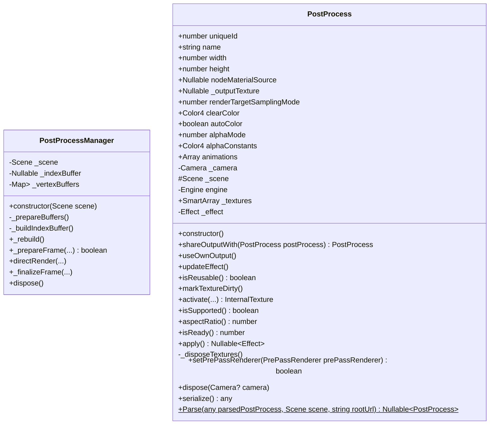
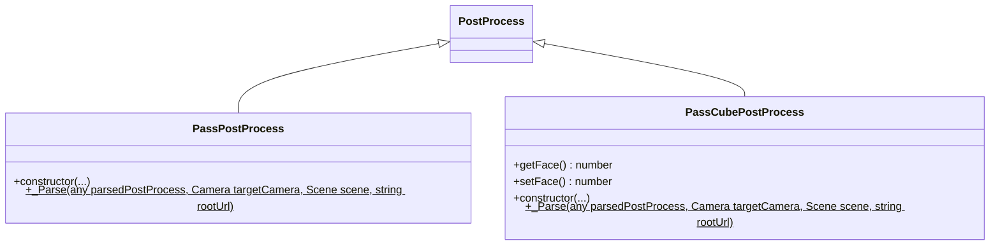
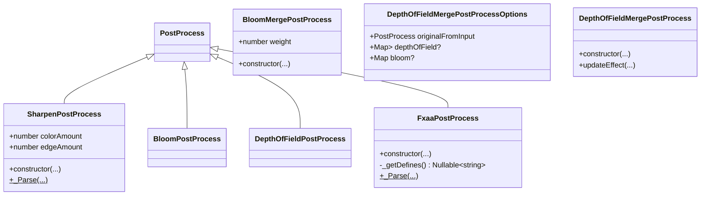
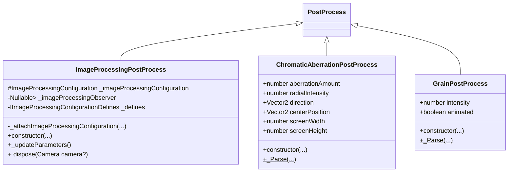
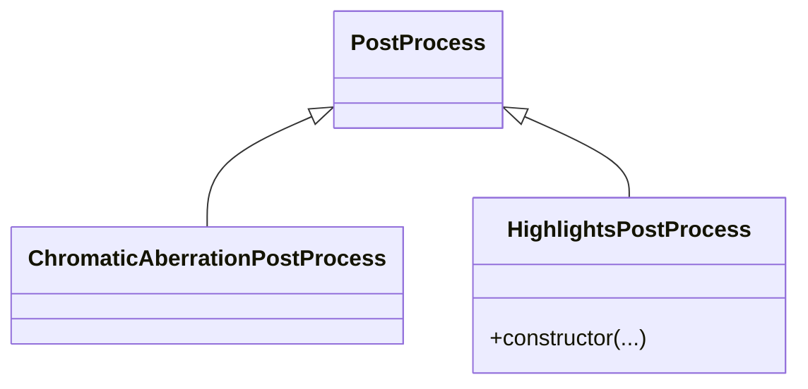
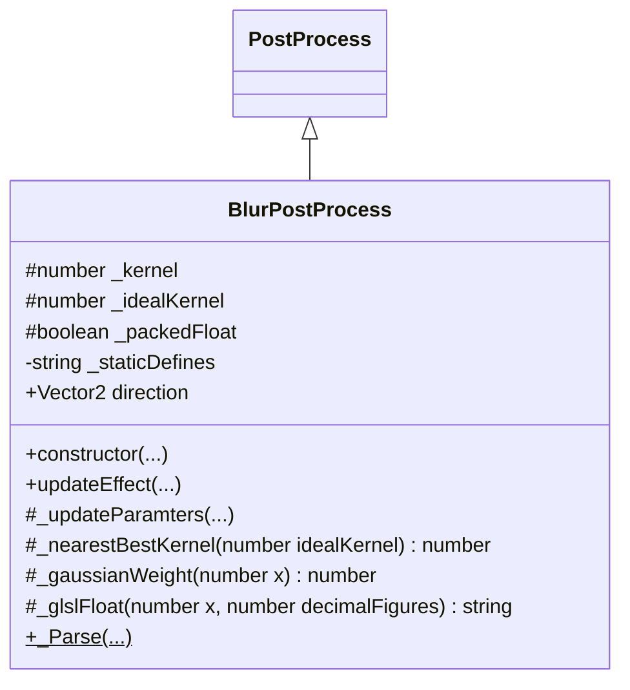

# **后处理**
# Overview
## 术语
## class relationship
### &starf; PostProcessManager & PostProcess

### &starf; Pass

### &starf; Default PipeLine

### &starf; Lens Pipeline
ChromaticAberrationPostProcess、HighlightsPostProcess、DepthOfFieldPostProcess

### &starf; SSAO Pipeline
SSAOPostProcess(PostProcess)、BlurPostProcess、SSAOCombinePostProcess(PostProcess)

&emsp;  
# Table Of Contents

&emsp;  
## &starf; PostProcess
后处理
&emsp;  
### methods
* \+ constructor()  
构造函数  
    &#9758; params
     * @param name   
        > The name of the PostProcess.
     * @param fragmentUrl  
        > The url of the fragment shader to be used.
     * @param parameters  
        > Array of the names of uniform non-sampler2D variables that will be passed to the shader.
     * @param samplers  
        > Array of the names of uniform sampler2D variables that will be passed to the shader.
     * @param options  
        > The required width/height ratio to downsize to before computing the render pass.  
        > (Use 1.0 for full size)
     * @param camera  
        > The camera to apply the render pass to.
     * @param samplingMode  
        > The sampling mode to be used when computing the pass. (default: 0)
     * @param engine  
        > The engine which the post process will be applied. (default: current engine)
     * @param reusable  
        > If the post process can be reused on the same frame. (default: false)
     * @param defines  
        > String of defines that will be set when running the fragment shader. (default: null)
     * @param textureType  
        > Type of textures used when performing the post process. (default: 0)
     * @param vertexUrl  
        > The url of the vertex shader to be used. (default: "postprocess")
     * @param indexParameters  
        > The index parameters to be used for babylons include syntax  
        > "#include<kernelBlurVaryingDeclaration>[0..varyingCount]".  
        > (default: undefined) See usage in babylon.blurPostProcess.ts and kernelBlur.vertex.fx
     * @param blockCompilation  
        > If the shader should not be compiled immediatly. (default: false)
     * @param textureFormat  
        > Format of textures used when performing the post process. (default: TEXTUREFORMAT_RGBA)  

    &#9758; flow  
    this.updateEffect(defines)    

* \+ updateeffect(...)
更新特效  
    &#9758; params
     * @param defines  
        > Define statements that should be added at the beginning of the shader. (default: null)  
     * @param uniforms  
        > Set of uniform variables that will be passed to the shader. (default: null)  
     * @param samplers  
        > Set of Texture2D variables that will be passed to the shader. (default: null)  
     * @param indexParameters  
        > The index parameters to be used for babylons include syntax  
        > "#include<kernelBlurVaryingDeclaration>[0..varyingCount]".  
        > (default: undefined) See usage in babylon.blurPostProcess.ts and kernelBlur.vertex.fx
     * @param onCompiled  
        > Called when the shader has been compiled.
     * @param onError  
        > Called if there is an error when compiling a shader.
     * @param vertexUrl  
        > The url of the vertex shader to be used (default: the one given at construction time)
     * @param fragmentUrl  
        > The url of the fragment shader to be used (default: the one given at construction time)   

    &#9875; flow  
    this._effect = this._engine.createEffect(...)

* \+ isReusable(): boolean  

* \+ markTextureDirty()  
使frame buffer失效，示意post process去创建depth buffer

* \+ activate(...): InternalTexture  
使用初始化的纹理激活post process  
    &#9758; params
    * @param camera   
        > The camera that will be used in the post process. This camera will be used when calling onActivateObservable.
    * @param sourceTexture  
        > The source texture to be inspected to get the width and height if not specified in the post process constructor. (default: null)
    * @param forceDepthStencil  
        > If true, a depth and stencil buffer will be generated. (default: false)
    * @returns  
        > The target texture that was bound to be written to.  

    &#9758; flow  
    this._textures.push(...)
    this._textures.forEach((texture)=>{this._engine.updateRenderTargetTextureSampleCount(...);)})
    this._engine.bindFrameBuffer(...)

* \+ isReady(): boolean  

* \+ apply(): Nullable<Effect>  

* \- _disposeTextures()

* \+ setPrePassRenderer(PrePassRenderer prePassRenderer): boolean  

* \+ dispose(Camera camera?)  

* \+ Parse(...)$  
