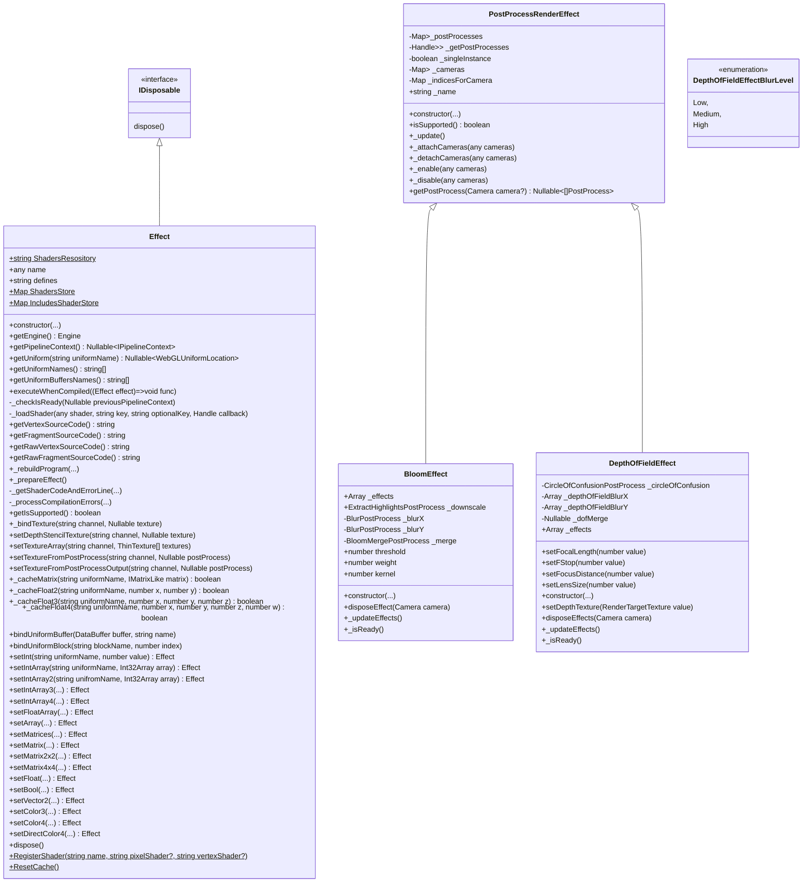
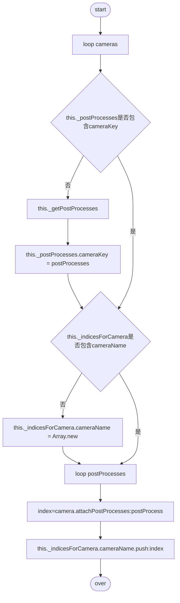
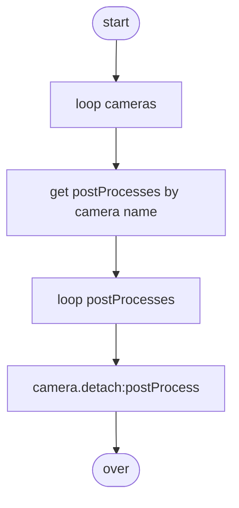

# **渲染效果**

# Overview

&emsp;  
## 术语
### &starf; anti-aliasing 抗锯齿效果  
* MSAA 多重采样抗锯齿
* FXAA 快速近似抗锯齿

### &starf; depth of field 景深效果 
在距离相机焦距一定距离时，景象变得模糊 

### tone mapping 色调映射
[see](#tone-mapping-details)  
首先要根据当前的场景推算出场景的平均亮度，再根据这个平均亮度选取一个合适的亮度域，再将整个场景映射到这个亮度域得到正确的结果  

### &starf; chromatic aberration 色差  
色差产生了沿边界分离图像的暗部和亮部的颜色条纹，模仿了真实相机在镜头不能将所有颜色连接到同一点时产生的颜色失真  
白光经过棱镜，不同的光由于波长不一样，穿过介质的速度不一样，不能聚焦在同一个焦点上，形成色散，即色差

### &starf; sharpen 锐化边缘
[see](#sharpen-details)  
通过增强物体边缘的对比度和区隔度，来让边缘显得更清晰锐利  

### &starf; bloom 泛光
朦胧模糊  
[see](#bloom-details)  
泛光是一种常见的视觉效果，图像的明亮部分会向较暗处稍微扩展。泛光效果可以突出显示图像的主要成分，还可以用来模拟衍射(光从窗口穿过时发生的物理现象)效果。  

### &starf; grain 颗粒特效
film grain  
电影颗粒是胶片上由于金属银(或彩色胶片上的染料云)的小颗粒的存在而产生的随机视觉感光纹理  
颗粒效果基于相干梯度噪声，通常被用来模仿电影的明显瑕疵

### HDR 高动态光照渲染
high dynamic range textures

### LDR
png、jpg

## class relationship


&emsp;  
# Table of Contents

&emsp;  
## &starf; PostProcessRenderEffect
后处理效果  
用纹理在渲染后接受shader
### properties
* _postProcesses
    > this._postProcesses = {}  
* _getPostProcess
    > this._getPostProcesses = this.getPostProcesses
### methods
* +getPostProcesses(camera?: Camera): Nullable<Array<PostProcess>>
    > 根据相机获取PostProcesses
    
* \+ _attachCameras(cameras: any): void
    > postProcess附加到相机


* \+ _detachCameras(cameras: any): void
  
    > postProcess与相机分离


* \+ _enable(cameras: any): void
    > camera.attatchPostProcess(postProcess, index)

* \+ _disable(camera: any): void
    > camera.detachPostProcess(postProcess)

# Details
## tone-mapping-details
四种方式:  
+ 1、Reinhard tone mapping  
    经验值  

    ```c
    float3 ReinhardToneMapping(float3 color, float adapted_lum) 
    {
        const float MIDDLE_GREY = 1;
        color *= MIDDLE_GREY / adapted_lum;
        return color / (1.0f + color);
    }
    ```
+ 2、S曲线  
    根据Reinhard的方法强行寻找S曲线  
    ```c
    float3 CEToneMapping(float3 color, float adapted_lum) 
    {
        return 1 - exp(-adapted_lum * color);
    }
    ```
+ 3、Filmic tone mapping  
    多项式拟合  
    ```c
    float3 F(float3 x)
    {
        const float A = 0.22f;
        const float B = 0.30f;
        const float C = 0.10f;
        const float D = 0.20f;
        const float E = 0.01f;
        const float F = 0.30f;
    
        return ((x * (A * x + C * B) + D * E) / (x * (A * x + B) + D * F)) - E / F;
    }

    float3 Uncharted2ToneMapping(float3 color, float adapted_lum)
    {
        const float WHITE = 11.2f;
        return F(1.6f * adapted_lum * color) / F(WHITE);
    }
    ```
+ 4、ACES  
    Academy Color Encoding System  
    多项式拟合(仅需一个多项式)
    ```c
    float3 ACESToneMapping(float3 color, float adapted_lum)
    {
        const float A = 2.51f;
        const float B = 0.03f;
        const float C = 2.43f;
        const float D = 0.59f;
        const float E = 0.14f;

        color *= adapted_lum;
        return (color * (A * color + B)) / (color * (C * color + D) + E);
    }
    ```

## sharpen-details
4个关键参数：
* 锐化数量
    > 锐化的强度
* 锐化半径
    > 锐化区域
* 细节
    > 哪些是边缘，多大的边缘参与锐化
* 蒙板
    > 哪些不是边缘，保护不需要锐化的区域，如天空

## bloom-details
三步骤：
* 提取亮色
* 对提取颜色部分进行高斯模糊
* 将模糊过的纹理与原场景纹理进行混合