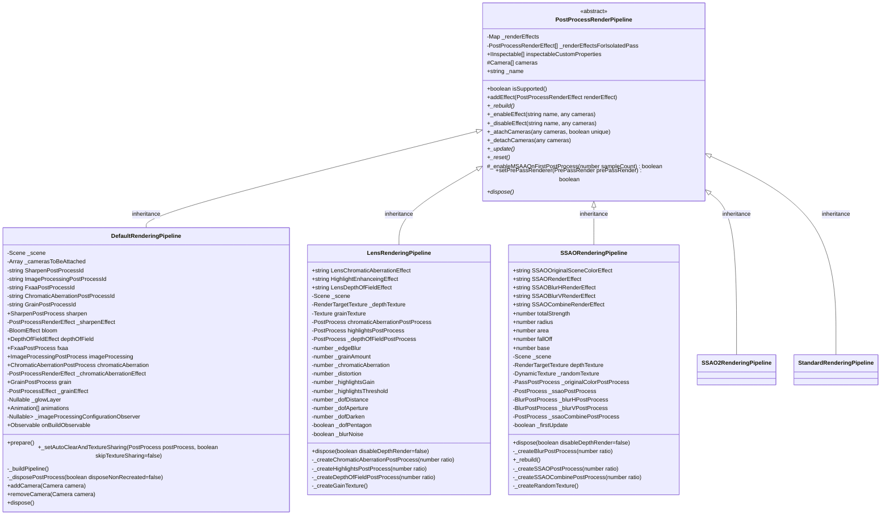

# **渲染管线**
# Overview

&emsp; 
## 术语

&emsp;  
### SSAO 屏幕空间环境遮罩
screen-space ambient occlusion
一般光照模型中，环境光用于模拟光线的二次散射，从而使得不受直接光照的地方也能有相应的亮度。
而犄角旮旯里，不应该有太多的光被散射出来，所以犄角旮旯和露出表面的环境光不应该相同。
在光照模型中，环境光是一个定值，ssao解决的就是 如何定量犄角旮旯应该吸收(二次散射不出去的光自然大部分都被物体吸收)多少环境光的问题

&emsp;  
## class extend relationship



&emsp;  
# Table of Contents   

## &starf; PostProcessRenderPipeline
后处理渲染管线
### properties
* -_renderEffects
    > 存放渲染效果  
    > { [key: string]: [PostProcessRenderEffect](&starf; PostProcessRenderEffect) }
    &emsp;  

* -_renderEffectsForIsolatedPass
    > 存放孤立的渲染通道的效果  
    > Array of [PostProcessRenderEffect](&starf; PostProcessRenderEffect)

### methods

* \- constructor
    > 构造函数  
    > this._cameras = []

* \+ addEffect(renderEffect: PostProcessRenderEffect): void
    > 添加effect
  
* \+ _enableEffect(renderEffectName:string, camera:any): void  
    > 启用effect
* \+ _disableEffect(renderEffectName: string, cameras: Nullable<Camera[]>): void
    > 禁用effect
* \+ _attachCameras(cameras: any, unique: boolean): void
    > 附加到camera 
    > 1. renderEffectName in this._renderEffects 
    > 2. this._renderEffects[renderEffectName]._attachCameras(cameras)   // postProcessRenderEffect._attachCameras(cameras: any): void [see](&starf; PostProcessRenderEffect)

* \+ _detachCameras(cameras: any): void
    > 从camera剥离效果

* \+ _update(): void
    > 更新效果  
    > this._renderEffects循环 RenderEffect._update()  
    > this._renderEffectsForIsolatedPass 循环cameraName this._renderEffectsForIsolatedPass)[cameraName]._update();

* \+ _reset(): void
    > 重置  
    > this._renderEffects = {}; this._renderEffectsForIsolatedPass = new Array();

* \- _enableMSAAOnFirstPostProcess(sampleCount: number): boolean
    > webgl2.0 抗锯齿  
    > postProcesses[0].samples = sampleCount;

## &starf; DefaultRenderingPipeline
默认渲染管线，包含常用的特效

### properties
* \- SharpenPostProcessId: string  
    > SharpenPostProcessEffect  
    > 锐化效果

* \- ImageProcessingPostProcessId: string  
    > ImageProcessingPostProcessEffect  
    > 图像加工效果

* \- FxaaPostProcessId: string  
    > FxaaPostProcessEffect  
    > 快速近似抗锯齿效果

* \- ChromaticAberrationPostProcessId: string
    > ChromaticAberrationPostProcessEffect  
    > 色差效果  

* \- GrainPostProcessId: string
    > GrainPostProcessEffect  
    > 颗粒效果

* \+ sharpen: SharpenPostProcess
    > 锐化  
    > 使用锐化卷积提升边界  
* \- _sharpenEffect: PostProcessRenderEffect

* \- bloom: BloomEffect
    > 泛光

* \+ depthOfFieldEffect: DepthOfFieldEffect
    > 景深  
    > 距离焦点一定距离后采用模糊效果

* \+ fxaa: FaxxPostProcess
    > 快速近似抗锯齿

* \+ imageProcessing: ImageProcessingPostProcess
    > 图像加工  
    > 处理色调映射(tone mapping)、色阶(color grading)等

* \+ chromaticAbereration: ChromaticAberrationPostProcess
    > 色差  
    > 移位rgb值

* \+ grain: GrainPostProcess  
    > 颗粒  
    > 为图像增加噪点
* \- _grainEffect: PostProcessRenderEffect

* \- _growLayer: Nullable<GlowLayer>
    > 辉光效果  

    > 为图像增加辉光区域

* \+ animations: Animation[]
    > 动画
    > 拉动时间线

* \- _bloomKernel: number
    > 泛光 核心

* \- _bloomWeight: number = 0.15
    > 泛光 权重

* \- _bloomThreshold: number = 0.9
    > 泛光 临界值

* \- _bloomScale: number = 0.5
    > 泛光 缩放

* \- _samples: number = 1
    > MSAA采样数量  
    > 4 = 4x, 

### methods
* \+ constructor(name: string = "", hdr: boolean = true, scene: Scene = EngineStore.LastCreatedScene!, cameras?: camera[], automaticBuild = true)
    > 初始化 scene, caps, hdr  
    > misc --> hdr是否采用，不采用则this._defaultPipelineTextureType为UnSignedInt，采用则根据caps选择Half Float或者Float   
    > attach --> scene.postProcessRenderPipelineManager.addPipeline(this); 
    > 预先创建各种PostProcess，以便于其在enable之前可以编辑  
    > 监听engine的onResizeObservable，用于设置this._hardwareScaleLevel
    > 监听scene的imageProcessingConfiguration.onUpdateParameters，用于设置this.bloom和this._imageProcessingEnabled，this._imageProcessingEnabled发生变更时需要执行this._buildPipeline()  
    > this._buildPipeline();  

* \+ prepare(): void  
    > this._buildAllowed = true;  
    > this._buildPipeline();  

* \- _setAutoClearAndTextureSharing(postProcess: PostProcess, skipTextureSharing = false)
    > 设置autoClear  
    > if (!skipTextureSharing) { ...; this._prevPostProcess = postProcess }

* \- _buildPipeline()  
    > this._disposePostProcess();  
    > this._prevPostProcess = null;  
    > 判定effect是否ready，如果ready执行add，例如：this.addEffect(fxaa)  

* \- _disposePostProcesses(disposeNonRecreated = false): void
    > imageProcessing和fxaadispose  
    > 在构造函数中创建且在每次渲染管线变更时不销毁
    > if (disposeNonRecreated) { dispose和置为null } 例如：this.fxaa.dispose(camera); this.fxaa = null;  

* \+ addCamera(camera: Camera): void
    > this._camerasToBeAttached.push(camera);  
    > this._buildPipeline();

* \+ removeCamera(camera: Camera): void
    ```js
        var index = this._camerasToBeAttached.indexOf(camera);
        this._camerasToBeAttached.splice(index, 1);
        this._buildPipeline();
    ```

* \+ dispose(): void
    > this.onBuildObservable.clear();  
    > this._disposePostProcesses(true);  
    > this._scene.postProcessRenderPipelineManager.detachCamerasFromRenderPipeline(this._name, this._cameras);  
    > super.dispose();


&emsp;  
## &starf; LensRenderingPipeline
处理屏幕边缘的微小RGB值 Separates very slightly R, G and B colors on the edges of the screen
特效构成：
* 色差 chromatic aberration (slight shift of RGB colors)
* 镜头边缘模糊 blur on the edge of the lens
* 棱镜形变 lens distortion
* 景深模糊&高光 depth-of-field blur & highlight enhancing
* 景深的散景 depth-of-field 'bokeh' effect (shapes appearing in blurred areas)
* 颗粒 grain texture

需求的纹理采样：
* 深度图 depth map (for depth-of-field)
* 颗粒纹理 grain texture


&emsp;
## &starf; SSAORenderingPipeline
环境光遮罩渲染管线

