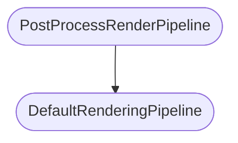
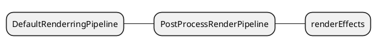
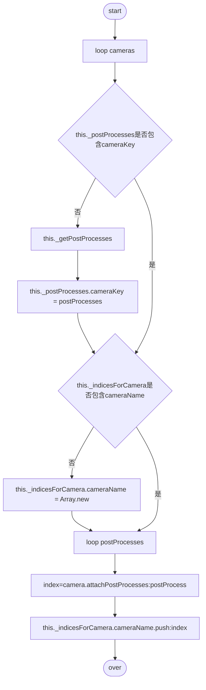
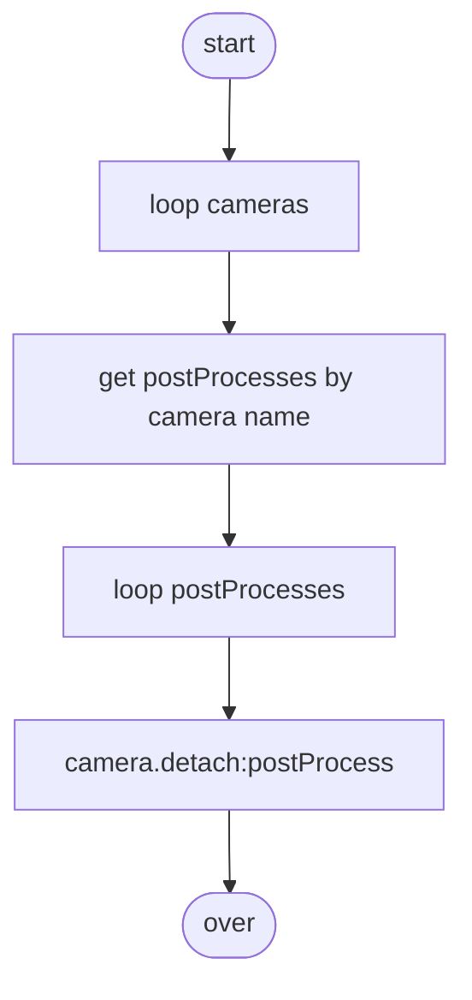

# **渲染管线**
# Overview
## class extend relationship

&emsp;  

# Table of Content
&emsp;  

## &star; mind

## &star; DefaultRenderingPipeline
默认渲染管线
### 术语
* anti-aliasing 抗锯齿效果
* depth of field 景深效果  
&emsp;  

## &star; PostProcessRenderPipeline
后处理渲染管线
### properties
* -_rederEffects
    > { [key: string]: [PostProcessRenderEffect](&star; PostProcessRenderEffect) }
    &emsp;  

* -_renderEffectsForIsolatedPass
    > Array of [PostProcessRenderEffect](&star; PostProcessRenderEffect)

### methods

* -constructor
    > 构造函数  
    > this._cameras = []

* +addEffect(renderEffect: PostProcessRenderEffect): void
    > 添加effect
  
* +_enableEffect(renderEffectName:string, camera:any): void  
    > 启用effect

* +_attachCameras(cameras: any, unique: boolean): void
    > 附加到camera 
    > 1. renderEffectName in this._renderEffects 
    > 2. this._renderEffects[renderEffectName]._attachCameras(cameras)   // postProcessRenderEffect._attachCameras(cameras: any): void [see](&star; PostProcessRenderEffect)

* +_detachCameras(cameras: any): void
    > 

* +_update(): void

* +_reset(): void
    > 重置

* -_enableMSAAOnFirstPostProcess(sampleCount: number): boolean

## &star; PostProcessRenderEffect
后处理效果
### properties
* _postProcesses
  
    > this._postProcesses = {}  
* _getPostProcess
  
    > this._getPostProcesses = this.getPostProcesses
### methods
* +getPostProcesses(camera?: Camera): Nullable<Array<PostProcess>>
  
    > 根据相机获取PostProcesses
    
* +_attachCameras(cameras: any): void
  
    > postProcess附加到相机

* +_detachCameras(cameras: any): void
  
    > postProcess与相机分离

* +_enable(cameras: any): void