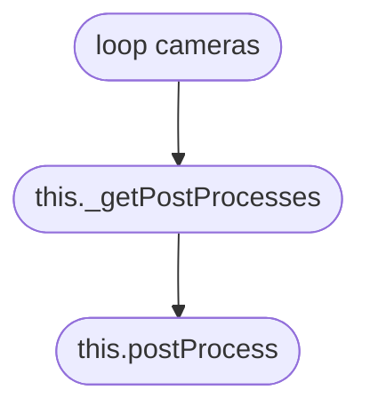

# **渲染管线**
# Overview

&emsp;  

# Table of Content
&emsp;  

## &star; DefaultRenderingPipeline
### 术语
* anti-aliasing 抗锯齿效果
* depth of field 景深效果  
&emsp;  

## &star; PostProcessRenderPipeline
###
&emsp;  

## &star; PostProcessRenderEffect
### properties
* _postProcesses
> this._postProcesses = {}  
* _getPostProcess
> this._getPostProcesses = this.getPostProcesses
### methods
* +getPostProcesses(camera?: Camera): Nullable<Array<PostProcess>>
> 根据相机获取PostProcesses

* +_attachCameras(cameras: any): void
>  

* +_detachCameras(cameras: any): void